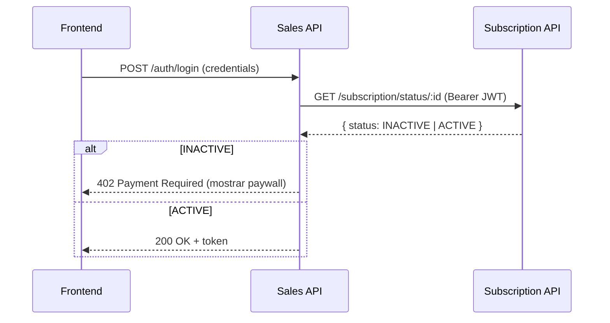
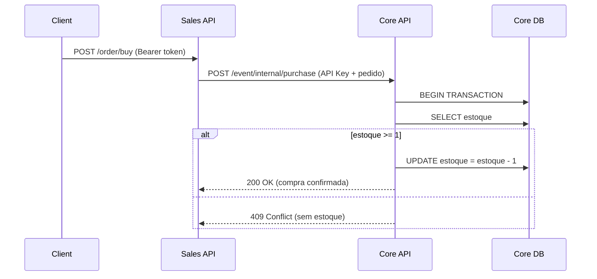
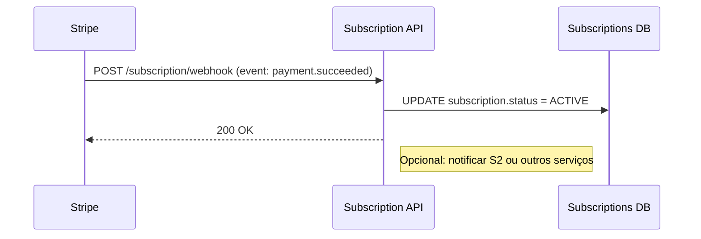

# 🚀 Projeto Final AV3: Noite a Fora - Sistema de Venda de Ingressos

## 🎓 Disciplina: Técnicas de Integração de Sistemas (AV3)

### 🧑‍💻 Equipe: Gabriel Guerreiro, Carlos Rodrigues, Diego dos Santos.

---

## 1. Visão Geral e Objetivo Principal

[cite_start]Este projeto é uma **solução integrada** que simula uma plataforma de venda de ingressos, aplicando os conceitos de comunicação entre sistemas e segurança[cite: 26].

[cite_start]O objetivo é demonstrar a **integração real entre três aplicações distintas** (microsserviços)[cite: 31], controlando o acesso de usuários por meio de uma barreira de pagamento (Paywall/Assinatura). [cite_start]A solução foi publicada em um repositório público [cite: 38] [cite_start]e deve ser implantada em um ambiente acessível externamente[cite: 41].

---

## [cite_start]2. Arquitetura do Sistema e Tecnologias [cite: 44, 45]

O projeto é construído em uma arquitetura de **Monorepo**, contendo três serviços Node.js/Nest.js.

| Pasta | Nome do Sistema | Função Principal | Porta Local | Schema DB |
| :---: | :---: | :---: | :---: | :---: |
| `sistema1` | **Core API** | Gerencia Eventos, Estoque e Autenticação de Organizadores. | `3001` | `public` |
| `sistema2` | **Sales API** | Orquestra Vendas, Autentica Clientes e Implementa a Barreira de Assinatura (Paywall). | `3000` | `sales` |
| `sistema3` | **Subscription API** | Gerencia o status de Assinatura e recebe o Webhook de Pagamento. | `3002` | `subscriptions` |

### 2.1. Tecnologias Utilizadas

* **Frameworks:** Nest.js, Prisma (ORM)
* **Linguagem:** TypeScript
* **Banco de Dados:** PostgreSQL (Local para desenvolvimento)
* **Segurança:** JWT, bcrypt
* **Integração:** Axios (@nestjs/axios) para comunicação HTTP Server-to-Server
* **Gateway de Pagamento:** Stripe SDK (Modo Teste)

---

## [cite_start]3. Fluxos de Integração e Endpoints [cite: 47]

O projeto demonstra três padrões de integração distintos:

### A. Fluxo de Barreira de Assinatura (Paywall)

Este fluxo é síncrono e verifica a autorização do cliente.

| Sistema | Método | Rota | Padrão | Descrição |
| :---: | :---: | :---: | :---: | :---: |
| **S2 (Login)** | `POST` | `/auth/login` | Síncrono | Tenta logar o cliente. **Chama o S3.** |
| **S3 (Sub)** | `GET` | `/subscription/status/:id` | Síncrono | **(INTEGRAÇÃO)** O S2 chama o S3 para verificar se o status do cliente é `ACTIVE`. |
| **S3 (Sub)** | `POST` | `/subscription/pay` | Síncrona | Gera o link de checkout do Stripe (Modo Teste). |

### B. Fluxo de Compra e Estoque

Este é o fluxo principal de requisição/resposta server-to-server.

| Sistema | Método | Rota | Proteção | Descrição |
| :---: | :---: | :---: | :---: | :---: |
| **S2 (Sales)** | `POST` | `/order/buy` | **Bearer Token** | Inicia a compra. **Chama o S1.** |
| **S1 (Core)** | `POST` | `/event/internal/purchase` | **API Key** | **(INTEGRAÇÃO)** Recebe o pedido do S2, verifica e decrementa o estoque em 1 (operação crítica). |

### C. Fluxo de Webhook (Pagamento Assíncrono)

Este fluxo é assíncrono e atualiza o banco de dados do Sistema 3 após um evento externo.

| Sistema | Método | Rota | Padrão | Descrição |
| :---: | :---: | :---: | :---: | :---: |
| **Stripe Cloud** | `POST` | `/subscription/webhook` | **Webhook** | **(INTEGRAÇÃO)** Recebe o aviso de pagamento aprovado e muda o status do cliente para `ACTIVE`. |

---

## [cite_start]▶️ 4. Instruções de Instalação e Execução [cite: 46]

### 4.1. Requisitos Prévios

* Node.js (v18+)
* **PostgreSQL** (Rodando localmente)
* Git

### 4.2. Setup Local

1.  **Clone o Repositório** (Monorepo):
    ```bash
    git clone [SUA URL DO GITHUB AQUI]
    cd Noite-a-Fora
    ```
2.  **Instale Dependências** (Repetir em cada pasta):
    ```bash
    cd sistema1 && npm install
    cd ../sistema2 && npm install
    cd ../sistema3 && npm install
    ```
3.  **Configurar Variáveis de Ambiente:**
    * No arquivo `.env` de cada `sistema`, ajuste a `DATABASE_URL` e as chaves de segurança (ex: `STRIPE_SECRET_KEY`).
4.  **Rodar as Migrações do Prisma:**
    * Rode os seguintes comandos (o banco de dados deve estar ativo na porta 5432):
        ```bash
        cd sistema1 && npx prisma migrate dev --name init
        cd ../sistema2 && npx prisma migrate dev --name init-sales
        cd ../sistema3 && npx prisma migrate dev --name init-subscriptions
        ```

### 4.3. Execução

Você precisará de três terminais separados (um para cada sistema):

| Terminal | Pasta | Comando | Porta |
| :---: | :---: | :---: | :---: |
| **1** | `sistema1` | `npm run start:dev` | `3001` |
| **2** | `sistema2` | `npm run start:dev` | `3000` |
| **3** | `sistema3` | `npm run start:dev` | `3002` |

---

## 5. Demonstração (Teste de Fluxo Completo)

O fluxo demonstra como a compra de um ingresso no **Sistema 2** é bloqueada pelo **Sistema 3** até que o pagamento seja confirmado, o que, por sua vez, afeta o estoque no **Sistema 1**.

1.  **Registro de Cliente:** `POST http://localhost:3000/client/register`
    * *Resultado:* Assinatura criada no S3 com status `INACTIVE`.

2.  **Login e Paywall:**
    * `POST http://localhost:3000/auth/login`
    * O S2 faz uma chamada Síncrona ao S3 (`GET /subscription/status`) e vê `INACTIVE`.
    * O frontend deve mostrar o Paywall.

3.  **Liberação de Acesso:**
    * Simular o pagamento do Stripe usando o link gerado por `POST http://localhost:3002/subscription/pay`.
    * O Stripe envia o Webhook para o S3.
    * O S3 muda o status para `ACTIVE`.

4.  **Compra Integrada:**
    * `POST http://localhost:3000/order/buy` (com token do cliente `ACTIVE`)
    * O S2 chama o S1 (`POST /event/internal/purchase`) para dar baixa no estoque.

---

## **6. Diagramas de Arquitetura e Fluxos**

Abaixo estão os diagramas da arquitetura do sistema e os principais fluxos de integração (Mermaid). Você pode visualizar esses diagramas no GitHub ou em editores com suporte a Mermaid.

**Arquitetura (visão geral)**

```mermaid
graph LR
    F[Frontend] -->|Login / Compra| S2[Sales API<br/>(porta:3000)]
    S2 -->|GET /subscription/status/:id<br/>(Bearer JWT)| S3[Subscription API<br/>(porta:3002)]
    S2 -->|POST /event/internal/purchase<br/>(API Key)| S1[Core API<br/>(porta:3001)]
    S3 -->|grava| DB3[(Postgres - subscriptions)]
    S1 -->|grava| DB1[(Postgres - public)]
    S2 -->|grava| DB2[(Postgres - sales)]
    Stripe[Stripe (Gateway - modo teste)] -->|webhook POST /subscription/webhook| S3
    S3 -->|gera link checkout| Stripe
    classDef services fill:#f9f,stroke:#333,stroke-width:1px;
    class S1,S2,S3 services;
```

**Fluxo A — Barreira de Assinatura (Paywall)**



**Fluxo B — Compra e Estoque (server-to-server crítico)**



**Fluxo C — Webhook (Pagamento assíncrono)**



**Legenda e observações**

- **Autenticação:** S2 usa JWT para autenticar clientes; chamadas internas críticas S2->S1 usam `API Key` entre serviços.
- **Bancos:** cada sistema tem seu schema/BD (public, sales, subscriptions) conforme tabela anterior.
- **Stripe:** usado em modo teste para gerar checkout; envia webhook para `sistema3`.
- **Renderização Mermaid:** GitHub suporta Mermaid nativamente; localmente, use um preview com suporte a Mermaid (ex.: extensão "Markdown Preview Enhanced" ou similar no VS Code).
